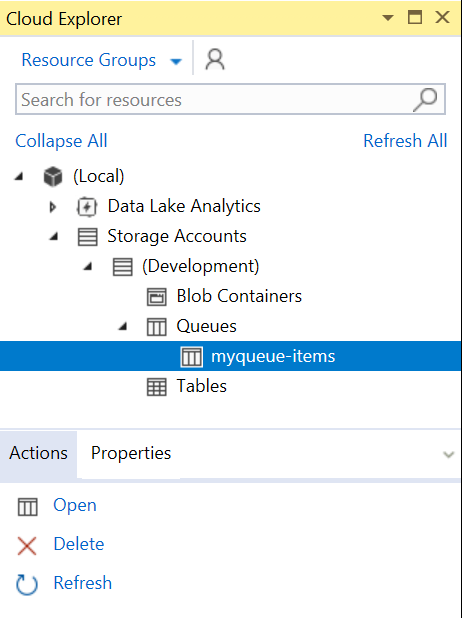
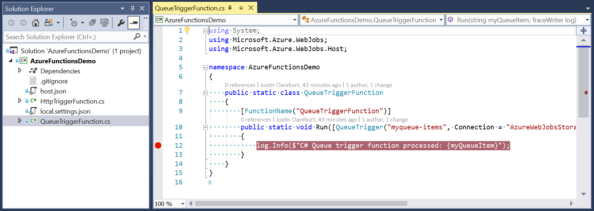
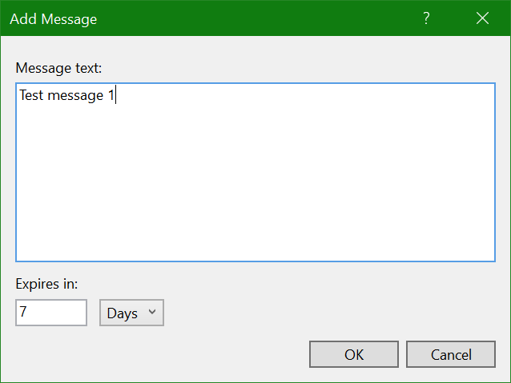
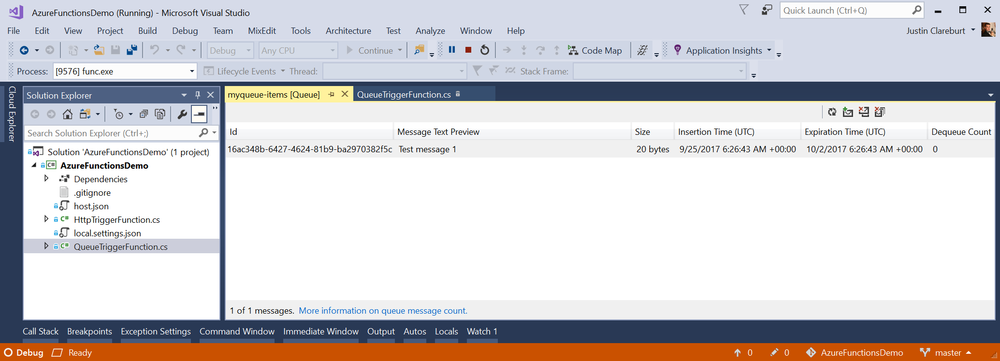
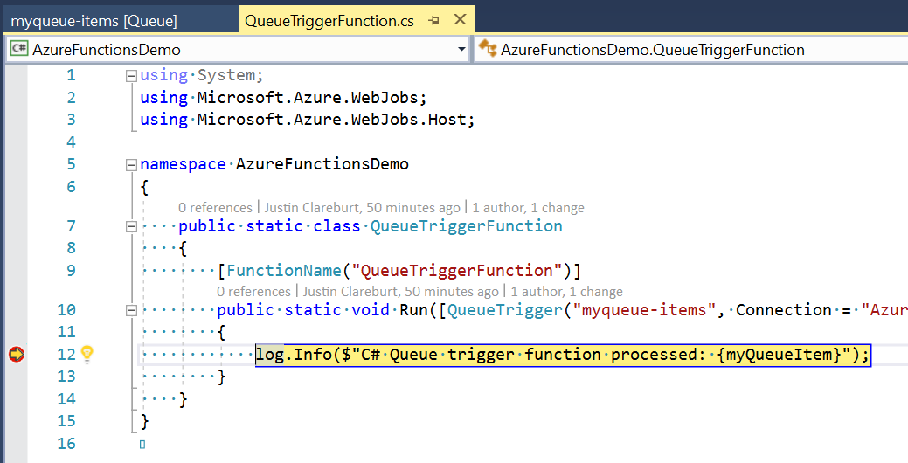

# Azure Functions Demo

This walk-through shows how to use Visual Studio to create an Azure Functions project.

The sample project includes two different types of Azure Functions and demonstrates:
- how to trigger a function when an item shows up in a Queue (using a Queue Trigger)
- how to trigger a function when a user posts an HTTP request (using an HTTP Trigger)
- how to configure a local storage queue for testing (using Windows Storage Emulator)
- how to locally debug an Azure Function

The major steps in the tutorial are:
1. [Setup Functions Project inside Visual Studio](#setupProject)
2. [Setup Queue (for Queue Trigger)](#setupQueue)
3. [Test/Debug the Queue Trigger (Locally)](#testQueueTrigger)
4. [Test the Http Trigger (Locally)](#testHttpTrigger)

##  Setup Functions Project inside Visual Studio

### Option 1: Fetch source from GitHub

- Clone source from GitHub: https://github.com/justcla/AzureFunctionsDemo

### Option 2: Setup Project from Scratch

#####  Create New Azure Functions Project (AzureFunctionsDemo)

- File -> New -> Project
  - Visual C# -> Cloud -> Azure Functions
    - Name: "AzureFunctionsDemo"

##### Create New Function - Http Trigger (HttpTriggerFunction.cs)

- Project -> Add New Item…
  - Visual C# Items -> Azure Function
    - Name: "HttpTriggerFunction.cs"

##### Create New Function - Queue Trigger (QueueTriggerFunction.cs)

- Project -> Add New Item…
  - Visual C# Items -> Azure Function
    - Name: "QueueTriggerFunction.cs"
    - Connection: "AzureWebJobsStorage"
- Update local.settings.json
    - "AzureWebJobsStorage": "UseDevelopmentStorage=true"

## Setup Queue (for Queue Trigger)

- Start Azure Storage Emulator
  - From Windows Status bar 

- Open Cloud Explorer in Visual Studio
  - View->Cloud Explorer
- Add queue to local storage account
  - Expand: (Local) -> Storage Accounts -> (Development) -> Queues
  - Create Queue: "myqueue-items" 

## Test/Debug the Queue Trigger (Locally)

### Run Project (in Debug mode)

- Debug -> Start Debugging (F5) 
Functions Terminal Window will start 

- Set breakpoint in QueueTriggerFunction.cs (line 12) 

### Add a message to the queue: "Test message 1"

- Open queue: myqueue-items (from Cloud Explorer) 

- Use the "Add Message" icon - 3rd from the right on queue toolbar
- Enter text into message box: "Test message 1" 
 
  Message appears in queue explorer window in Visual Studio 

### Step through code in Visual Studio

- [Wait 10 seconds] 
Program will break on line 12 

- Debug -> Step Over (F10) 
New messages printed in Functions Terminal Window 
 
Note: "Test message 1" appears printed on the console.

- Debug -> Continue (F5) 
Execution completes.

- Debug -> Stop Debugging (Shift+F5)

## Test the Http Trigger (Locally)

- Debug -> Start Debugging (F5) 
Functions Terminal Window will start 

- Note the URL of the Http Function (HttpTriggerFunction) printed in the terminal window. 
Eg. http://localhost:7071/api/HttpTriggerFunction

- Open a web browser and enter the Http Function URL 
 
Program runs and asks for a "name" parameter.

- Append name parameter to URL query string 
Eg. http://localhost:7071/api/HttpTriggerFunction?name=Harry  
 
Program runs and outputs: "Hello Harry"

- Debug -> Stop Debugging (Shift+F5)
